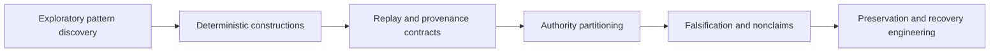

# Methodological evolution (tentative)

```mermaid
flowchart LR
  A[Exploratory pattern discovery] --> B[Deterministic constructions]
  B --> C[Replay and provenance contracts]
  C --> D[Authority partitioning]
  D --> E[Falsification and nonclaims]
  E --> F[Preservation and recovery engineering]
```

This timeline is a hypothesis constrained by observed repository documentation.
