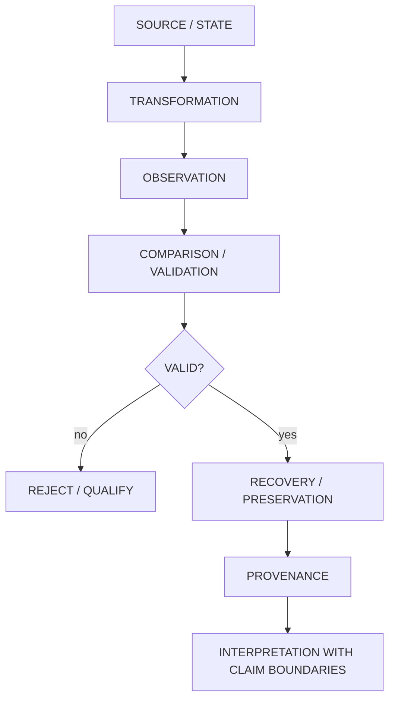

# Research architecture (working hypothesis)

```mermaid
flowchart TD
  A[SOURCE / STATE] --> B[TRANSFORMATION]
  B --> C[OBSERVATION]
  C --> D[COMPARISON / VALIDATION]
  D --> E{VALID?}
  E -- no --> F[REJECT / QUALIFY]
  E -- yes --> G[RECOVERY / PRESERVATION]
  G --> H[PROVENANCE]
  H --> I[INTERPRETATION WITH CLAIM BOUNDARIES]
```

Not every project implements every stage.
